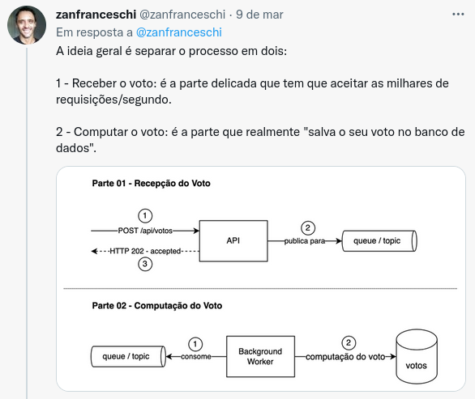

# async-poll

[](https://github.com/nenitf/async-poll/actions/workflows/ci.yml) [](https://neni.dev/async-poll/coverage/index.html) [](http://neni.dev/emojicom)

[](https://neni.dev/async-poll/swagger/index.html?url=https://neni.dev/async-poll/swagger/openapi.yaml) 

Sistema de votação que computa votos de maneira assíncrona

[](https://twitter.com/zanfranceschi/status/1501583683685425159)

## Execução local com Docker

### Configuração inicial

1. Duplique `.env.example` e renomeie para `.env`
    ```sh
    cp .env.example .env
    ```

2. **Mude o usuário (`DB_USERNAME`) e senha (`DB_PASSWORD`) de `.env`**

3. Crie os containers
    ```sh
    docker-compose up -d
    ```
    > Caso queira, ao final da configuração, pare os containers com ``docker-compose down``

4. Baixe as dependências do composer
    ```sh
    docker-compose exec app composer install
    ```

5. Crie a chave de criptografia
    ```sh
    docker-compose exec app php artisan key:generate
    ```

6. Crie as tabelas no banco
    ```sh
    docker-compose exec app php artisan migrate
    ```
    > Use também ``docker-compose exec app php artisan migrate:refresh --seed`` caso queira alguns exemplos

7. Crie a documentação de suporte que ficará disponível em `localhost:8989/swagger`
    ```sh
    docker-compose exec app composer swagger
    ```

8. Dê as permissões necessárias
    ```sh
    docker-compose exec app chmod -R 777 storage
    ```

### Execução

Com a **configuração inicial** já realizada, suba os containers se necessário e acesse a aplicação em `localhost:8989`

```sh
docker-compose up -d
```

#### Contagem de votos

```sh
docker-compose exec app php artisan queue:work
```

### Teste

- Individual
    ```sh
    docker-compose exec app composer test tests/caminho/do/ExemploTest.php
    ```

- Completo
    ```sh
    docker-compose exec app composer ci
    ```
